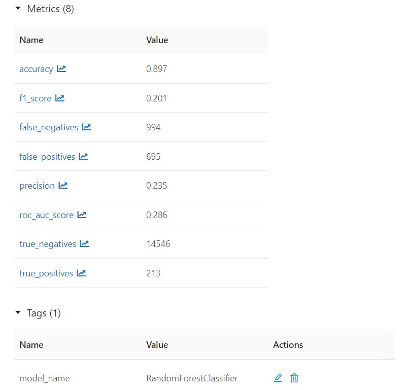
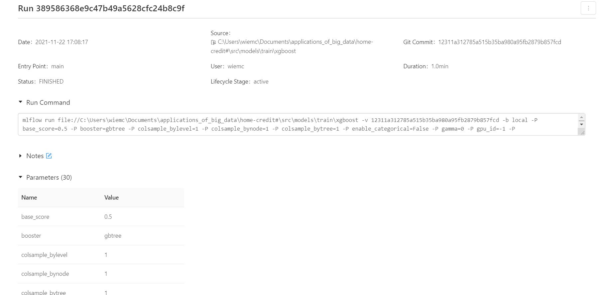
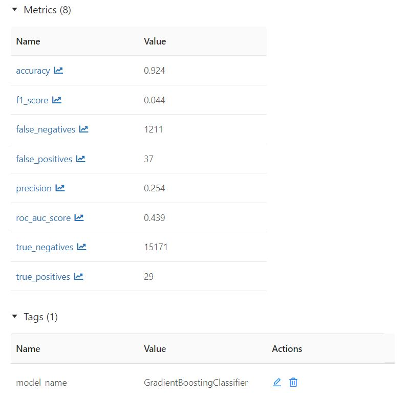
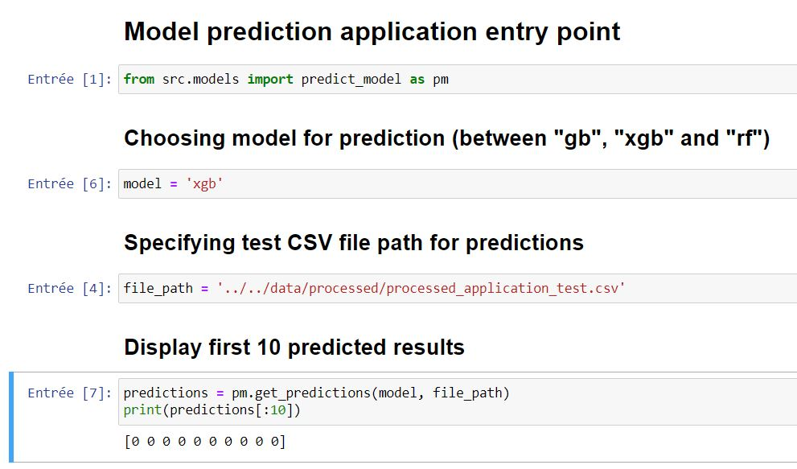

Home Credit Default Risk - Applications of Big Data project
==============================

Applications of big data project around the **"Home Credit Default Risk" Kaggle competition** (https://www.kaggle.com/c/home-credit-default-risk/overview)

## Project Organization
------------

    ├── LICENSE
    ├── Makefile           <- Makefile with commands like `make data` or `make train`
    ├── README.md          <- The top-level README for developers using this project.
    ├── data
    │   ├── external       <- Data from third party sources.
    │   ├── interim        <- Intermediate data that has been transformed.
    │   ├── processed      <- The final, canonical data sets for modeling.
    │   └── raw            <- The original, immutable data dump.
    │
    ├── docs               <- A default Sphinx project; see sphinx-doc.org for details
    │
    ├── models             <- Trained and serialized models, model predictions, or model summaries
    │
    ├── notebooks          <- Jupyter notebooks. Naming convention is a number (for ordering),
    │                         the creator's initials, and a short `-` delimited description, e.g.
    │                         `1.0-jqp-initial-data-exploration`.
    │
    ├── references         <- Data dictionaries, manuals, and all other explanatory materials.
    │
    ├── reports            <- Generated analysis as HTML, PDF, LaTeX, etc.
    │   └── figures        <- Generated graphics and figures to be used in reporting
    │
    ├── requirements.txt   <- The requirements file for reproducing the analysis environment, e.g.
    │                         generated with `pip freeze > requirements.txt`
    │
    ├── setup.py           <- makes project pip installable (pip install -e .) so src can be imported
    ├── src                <- Source code for use in this project.
    │   ├── __init__.py    <- Makes src a Python module
    │   │
    │   ├── data           <- Scripts to download or generate data
    │   │   └── make_dataset.py
    │   │
    │   ├── features       <- Scripts to turn raw data into features for modeling
    │   │   └── build_features.py
    │   │
    │   ├── models         <- Scripts to train models and then use trained models to make
    │   │   │                 predictions
    │   │   ├── predict_model.py
    │   │   └── train_model.py
    │   │
    │   └── visualization  <- Scripts to create exploratory and results oriented visualizations
    │       └── visualize.py
    │
    └── tox.ini            <- tox file with settings for running tox; see tox.readthedocs.io
--------
## Project presentation

Home-credit is an application that aims to:

- Train and validate 3 Machine learning models (XGboost, Random Forest, Gradient Boosting) to classify home credit repayment ability of different individuals, following these basic steps :
  - **Data preparation**: collect and clean data, which is split into 2 CSV files, ```application_train.csv``` and ```application_test.csv```
  - **Model fit and validation** : using metrics such as accuracy score, F score, ROC Curve and confusion matrix 
  - **Class prediction** : 0 or 1 (0 = repayed correctly, 1 = not repayed)

- Provide client repayment abilities prediction, by selecting one of the 3 Machine Learning models trained before


| Algorithm Name    | Aim                                                                                                                                                                                                                       | 
|-------------------|---------------------------------------------------------------------------------------------------------------------------------------------------------------------------------------------------------------------------|
| Random forest     | Supervised machine learning algorithm that is constructed from decision tree algorithms                                                                                                                                   |
| XGboost           | Optimized distributed gradient boosting library designed to be highly efficient, flexible and portable                                                                                                                    |
| Gradient boosting | Method standing out for its prediction speed and accuracy, particularly with large and complex datasets. From Kaggle competitions to machine learning solutions for business, this algorithm has produced the best results|

*XGboost and Gradient boosting are one type of Boosting algorithm which is a supervised machine learning and consists of an ensemble learning technique that uses a set of Machine Learning algorithms to convert weak learner to strong learners in order to increase the accuracy of the model.*

--------

## Installation
### Prerequisites :

- **Python 3.9.X** (Programming language used in this application)

- **Poetry** (Python package manager), which can be installed with the following command : 

```shell
(Invoke-WebRequest -Uri https://raw.githubusercontent.com/python-poetry/poetry/master/get-poetry.py -UseBasicParsing).Content | python -
```

- **Anaconda3 or Miniconda** : with conda CLI enabled (add conda executable to path environement variable)

- **Pip (Python Package installer)** : after downloading get-pip.py move to the folder where get-pip.py is and run: ```python get-pip.py```. Pip normally comes packaged with Anaconda

- **cmake cli utility** : required by the shap library package, else shap installation fails

- **Compiler for llvm** : llvm is also used by shap, and requires a compiler, be it g++ for Linux or Microsoft Visual Studio C++ Redistributable packages x86 and x64 (https://docs.microsoft.com/en-us/cpp/windows/latest-supported-vc-redist?view=msvc-170) 

### Installation steps

1. Clone the following project repository: https://github.com/wiwiii/home-credit

2. Install global dependencies
    - From top-level directory folder (home-credit) type: ```pip install -r requirements.txt```

3. Install application dependencies
    - From top-level directory folder (home-credit) type: ```poetry install```, this command will install the dependencies listed in the file ```pyproject.toml``` and automatically write the poetry.lock file.

--------
## Getting started

Commands based on what you want to achieve


| Goal                                | Command                                                      | 
|-------------------------------------|--------------------------------------------------------------|
| Home credit default risk prediction | Move to top-level directory and run ```poetry run python app_predict.py``` for the python script version, or else run the ```./notebooks/app/5.0-cbw-app-predict.ipynb``` jupyter notebook | 
| Train and validate ML models | Move to top-level directory and run ```poetry run python app_train.py``` for the python script version, or else run the  ```./notebooks/app/4.0-cbw-app-train.ipynb``` |
| Vizualize XGBoost SHAP outputs | Run the ```./notebooks/app/6.0-cbw-xgboost-xai.ipynb``` jupyter notebook (and do not forget to trust it to allow JS outputs to display) | 

## Our project implementation

We've followed the cookie cutter structure provided here : https://drivendata.github.io/cookiecutter-data-science/ .

### Data collection and data preparation


- We've automated the data collection (works on Windows machines only currently, can be extended to Linux and OSX in further versions) using the **Kaggle API CLI tool** (https://github.com/Kaggle/kaggle-api). As a result, calling the ```app_predict.py``` or the ```4.0-cbw-app-train.ipynb``` entry points results in downloading the zipped competition dataset, unzipping it and putting the CSV files in ```./data/external``` and then removing the .zip folder.

- We've only used the ```application_train.csv``` and ```application_test.csv``` files in this project

- 2 versions are available : 
  - As python scripts in ```./src/data/make_dataset.py``` and ```./features/build_features.py``` 
  - Or as notebooks in ```./notebooks/data/1.0-cbw-data-retrieval.ipynb``` and ```./notebooks/data/2.0-cbw-preprocessing.ipynb```

- The data is then processed following this order :

    - Move target feature to last column in train dataset
    - Drop unused ```SK_ID_CURR``` column in both train and test datasets
    - Align train and test columns
    - Impute missing numerical data by replacing it by the column median in both train and test datasets
    - Drop categorical features na rows (empty rows) in both train and test datasets
    - Scale numerical features by standardizing them to get values between approximately -3 and 3 in both train and test datasets
    - Encode categorical features with One Hot Encoding (using pandas get_dummies()) in both train and test datasets
    - Align again train and test columns as some categorical values were missing in test dataset compared to train dataset
    - Export processed data to CSV files in ./data/processed as ```processed_application_train.csv``` and ```processed_application_test.csv```

### Model train and metrics with MLFlow

- 2 versions are available : 
  - As python scripts in the ```./src/models/train``` folder, in the 3 corresponding folders. Each one follows the MLproject convention to track models with MLFlow, using a conda environment specified in the ```conda.yml``` file and running the ```xxx_train.py``` associated train script. In order to track models with MLFlow, the ```mlflow run mlproject_folder_path``` command is launched from the train entry point.
  - Or as notebooks in the ```./notebooks/train``` folder, with a notebook for each model.

- The general flow is the following :
  - Split processed data into train and test
  - Instanciate the model class with generic parameters.
  - **Remark** : as we didn't have much time and experience, we've used the parameters provided in the XAI lab, as well as the GridSearch technique from the same lab to set their parameters, except for the Gradient Boosting classifier model.
  - Start MLFlow run : track model parameters, track model metrics (accuracy, F score, ROC curve, confusion matrix), track model version, set model tag for subsequent retrieval with mlflow.sklearn.load_model for the prediction app entry point (tags are "gb" for Gradient Boosting, "xgb" for XGBoost and "rf" for Random Forest)
  - In the MLFlow UI, we can vizualize the results of the tracking with ```mlflow ui``` :
  
  

    - **Random Forest** :
    
    

    

    - **XGBoost** :
    
    

    

    - **Gradient Boosting** :
    
    

    

- In each notebook in ```./notebooks/train```, a ROC curve plot has been added.

### Model prediction

**Remark** : for performance concerns, we will not run predictions on the whole dataset though it would be practically the same code. Also, for prediction, we retrieve the latest run associated with the chosen model and take the one with the max accuracy.

- **Random Forest** :


- **XGBoost** :




- **Gradient Boosting** :


### XAI SHAP outputs for XGBoost explainability

- **Building SHAP values and showing explainer base value** :


- **Vizualizing explanations for a single line in test dataset** :


- **Vizualizing explanations for all lines in test dataset at once (subsample at 1000 lines for performance concerns)** :


- **Vizualizing a summary plot for each class on the whole dataset (subsample at 1000 lines)** :


## Documentation

- We've commented out the functions used in the scripts and in the notebooks using the Python docstring convention from PEP 257 (https://www.python.org/dev/peps/pep-0257/)

- We've generated our project documentation using Sphinx, the files are available in the ```docs``` folder

- Our ```README.md``` is presented as our project report

## Difficulties

- **Data pre-processing** : we've applied the minimum required pre-processing to both train and test CSV files that we've retrieved from Kaggle but as the classes were very unbalanced between both files, we did not have the time to find a solution to split them equally between the dataframes used to fit the models. Also, we did not have much experience regarding data processing as we're part of the apprentice group and we've only had an introduction to machine learning last year without insisting on data preparation. We also decided to remove our choices regarding feature selection because we found that they were not relevant regarding our problematic, so we ended up keeping all features and even adding some with one hot encoding

- **Dependencies** : we had to ensure that the project could be run on another machine so we chose to add ```poetry``` as a dependency management tool, however, we've encountered problems installing some of the dependencies so we decided to also keep a ```requirements.txt``` file to save these dependencies and to be able to install them with pip instead in our virtual environment.

- **Model train** : we did not have much experience so we've mainly tried to make the workflow functional but our models are clearly under-performing (as you can see on the ROC curve in each model train notebook with our model curve being under the no-skill model's curve). Unfortunately, we did not find a solution regarding this issue of bad metrics, even if the models have a global good accuracy, their F score and confusion matrix metrics are still bad without us being aware of a potential reason why it would behave so.

- **XAI outputs** : we've decided not to output all lines explanations because it was too slow for our computers

- **Writting documentation** : making build documentation generate errors sometimes, we've needed to delete before any build, the html folder to avoid it. Therefore, sphinx executes notebooks and raises many errors and display it in documentation html files.

--------

## Contributors

&nbsp;

**Wiem CHOUCHANE**

**Carine TALANDIER**

**Brunelle MALANDILA LEYA**

**M2 APP LS1**

**Big Data & Machine Learning**

--------
<p><small>Project based on the <a target="_blank" href="https://drivendata.github.io/cookiecutter-data-science/">cookiecutter data science project template</a>. #cookiecutterdatascience</small></p>
